# SaaS Analytics Infrastructure On AWS

This project demonstrates how to create a cross-participant analytics SaaS
solution on the AWS cloud. Users of the SaaS offering can submit input files
and the SaaS application will perform analytics calculations by aggegating
the inputs. After the calculations are performed, users will be able to 
download the aggregated results.

Users are isolated from one another. They cannot see the
inputs provided by other users or the outputs provided to them.

Users can send and receive files by logging in to a UI portal or
by connecting via SFTP.

SaaS administrators have a dedicated UI portal where they can see which
users have submitted files, execute analytics, and view reports.

If you wish to jump directly to the setup, see the [Deployment Steps](documentation/DEPLOYMENT.md).

## The Components of SaaS

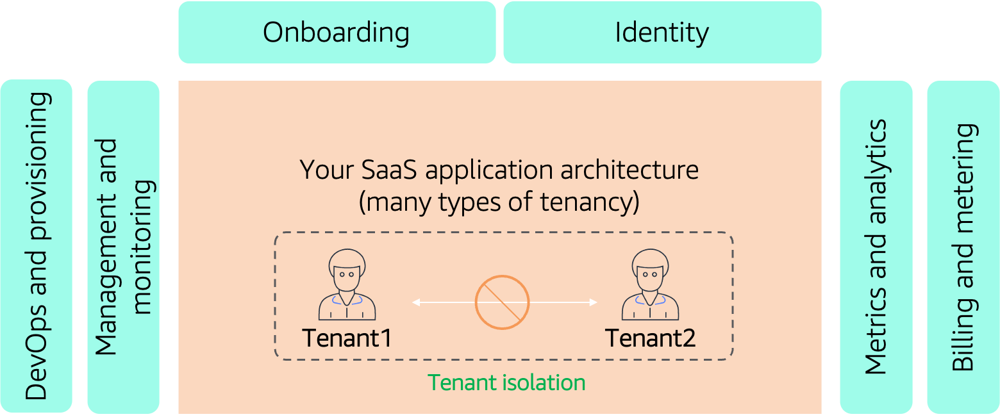

## Admin Portal

### Admin - Login Screen

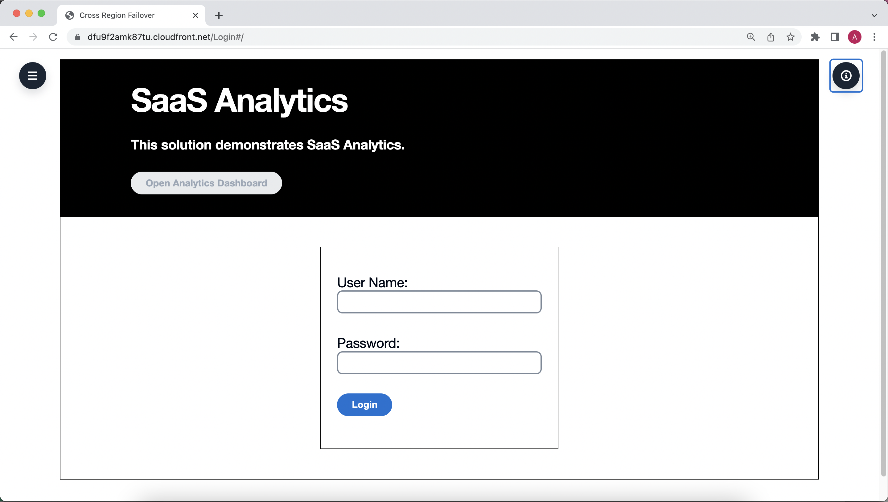

### Admin - View User Input Screen

The admin can see which files have been uploaded by which users and the date of the upload.

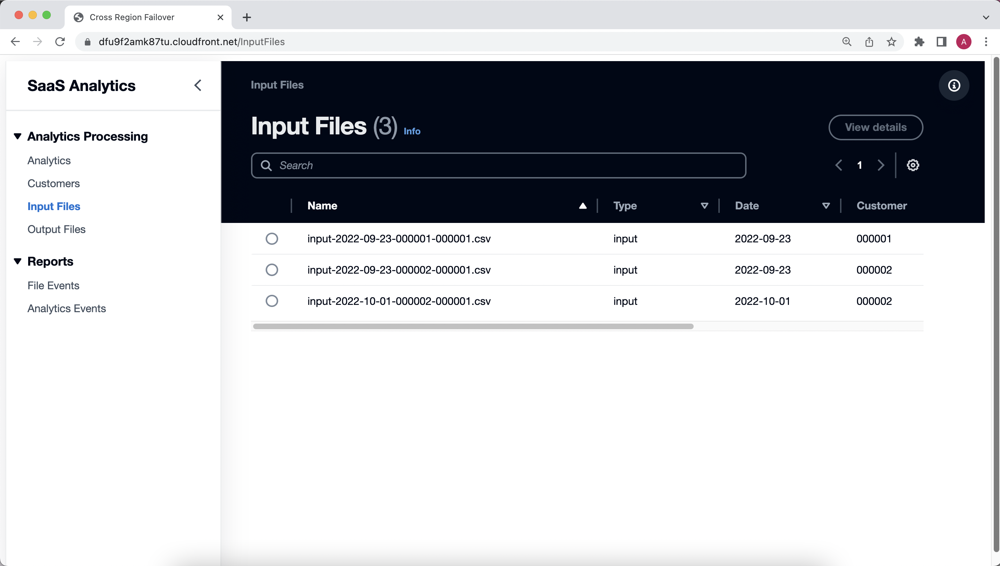

### Admin - Execute Analytics Screen

The admin can choose to run one or multiple analytics processes on the input files 
received from users. The analytics can be initiated through the Web console or as 
a batch job at a scheduled time. 

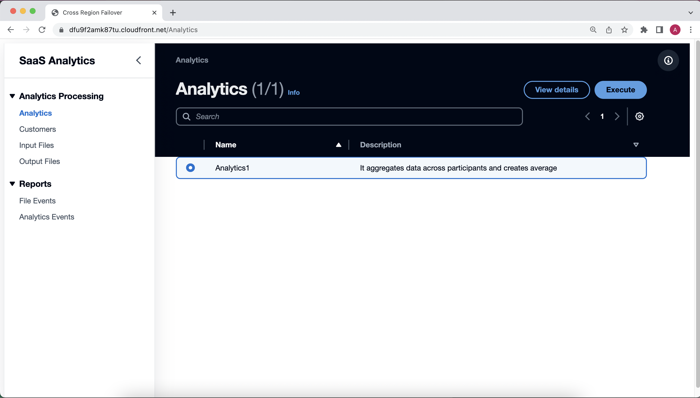

### Admin - View Analytics Output Files Screen

The admin can see which files were created by the analytics execution process. 

### Admin - Monitoring Received Input Files Screen

The admin can see which files have been uploaded by users and when this occurred. 

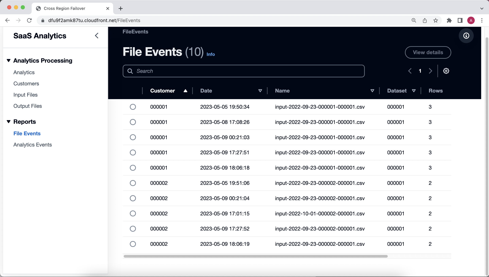

### Admin - Monitoring Analytics Executions Screen

The admin can see when analytics were run and how long they took to execute. 

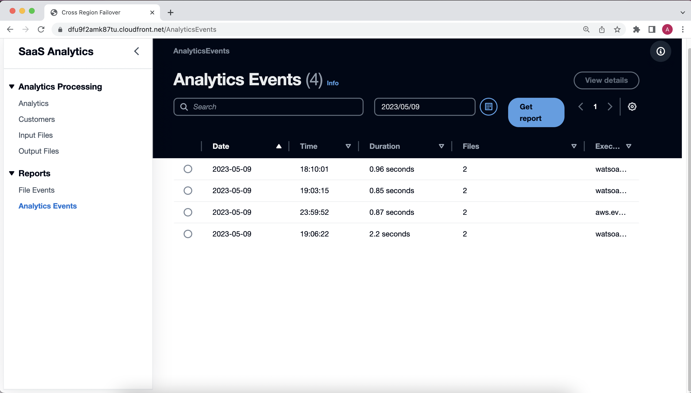

## User Portal

### User - Login Screen

Users can sign up and log in.

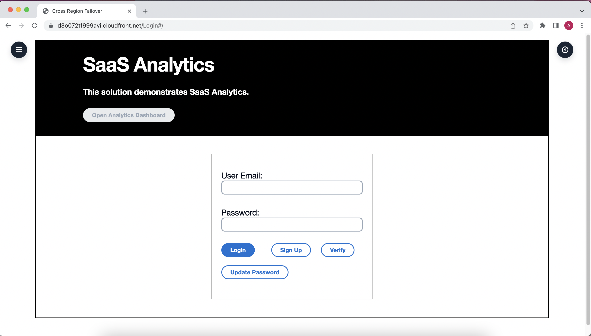

### User - Upload Input File Screen

Users can upload input files for analytics processes to utilize.

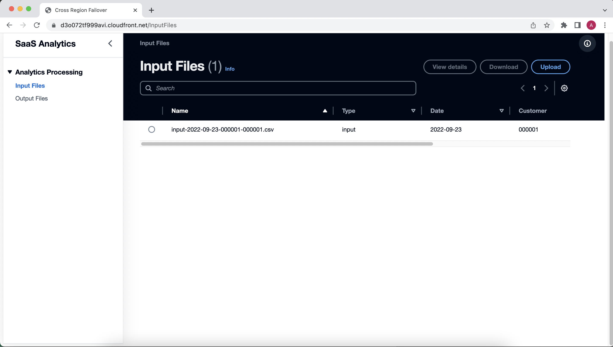

### User - Download Output File Screen

Users can download the analytics results files.

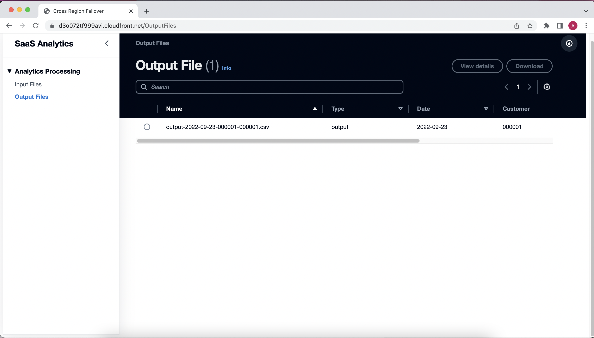

## Isolated Data Storage Per SaaS Tenant

The below diagram depicts the solution's separate data storage silos for tenants. For each
tenant, there is a pair of S3 buckets dedicated strictly to that tenant. The first bucket 
stores input files and the second stores output files. A separate security role is created per tenant that has read/write access to the buckets for the tenant. Only the users for that particular tenant and the analytics program can assume this role. This makes sure that no one else including administrators can access these buckets. 

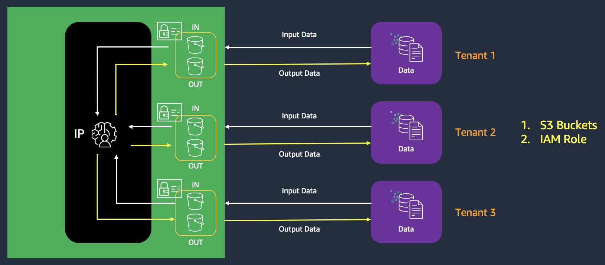

## The SFTP Process

As an alternative to using the Web console, users can choose to utilize SFTP
to programmatically send input files and receive output files.

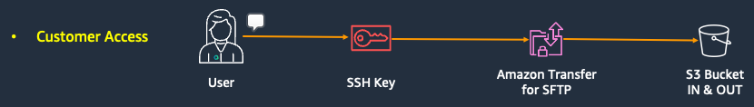

## Deploying This Solution

See the [Deployment Steps](documentation/DEPLOYMENT.md).

 ## Security

See [CONTRIBUTING](CONTRIBUTING.md#security-issue-notifications) for more information.

## License

This library is licensed under the MIT-0 License. See the LICENSE file.
